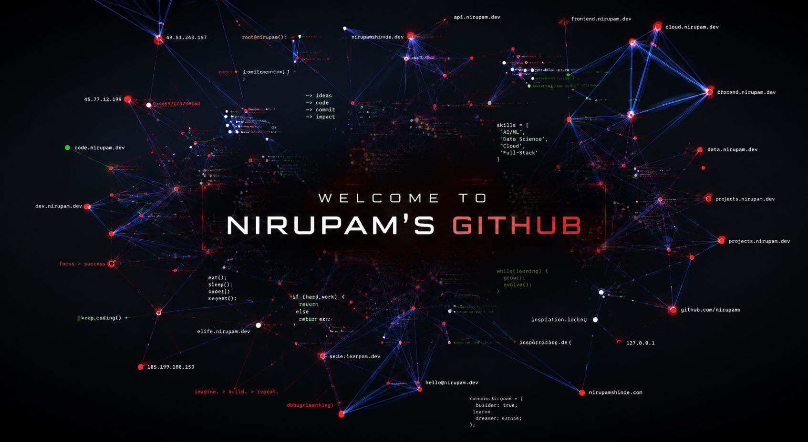

<div align="center">



<br>

### Data Scientist • AI Engineer • Cloud Enthusiast

Building intelligent products through **Data**, **Artificial Intelligence**, and **Cloud Computing**.

Focused on creating scalable software, intelligent systems, and impactful digital experiences.

<br>

<p align="center">
  <a href="mailto:nirupamshinde7@gmail.com">
    
  </a>

  <a href="https://www.linkedin.com/in/nirupam-shinde-360514354">
    
  </a>

  <a href="https://github.com/7nirupam">
    
  </a>
</p>

</div>

---

## About Me

```text
Education      : M.Sc. Data Science & Big Data Analytics
Focus          : Data Science • Artificial Intelligence • Cloud
Current Goal   : Building AI-powered products with real-world impact
Learning       : Machine Learning, AWS, Data Engineering
Open To        : Open Source • Collaboration • Research • Innovation
```
---

<div align="center">

<table>
<tr>

## Tech Stack

<div align="center">

### Languages


<br><br>

### Data & AI


**Pandas • NumPy • Scikit-Learn • Matplotlib**

<br><br>

### Cloud


**Amazon EC2 • Amazon S3 • AWS Lambda**

<br><br>

### Tools


</div>

---

---

# Featured Projects

### ☁️ AWS Cloud Projects
A collection of hands-on cloud projects focused on deploying scalable applications, cloud storage, compute services, and serverless architectures.

**Tech:** AWS • EC2 • S3 • Lambda • IAM

---

### 🤖 AI Resume Analyzer
An intelligent resume analysis platform that provides ATS scoring, skill insights, and personalized recommendations.

**Tech:** Python • Machine Learning • Flask

---

### 📊 Data Science Projects
A curated collection of data analysis, machine learning, and visualization projects using real-world datasets.

**Tech:** Python • Pandas • NumPy • Scikit-Learn • Matplotlib

---

---

# Contribution Graph

<div align="center">


</div>

---
---

# Let's Connect

<div align="center">

<a href="mailto:nirupamshinde7@gmail.com">
  
</a>

<a href="https://www.linkedin.com/in/nirupam-shinde-360514354">
  
</a>

<a href="https://github.com/7nirupam">
  
</a>

</div>

---
<div align="center">

> **Turning ideas into scalable products through AI, data, and cloud technologies.**

</div>

<br>


